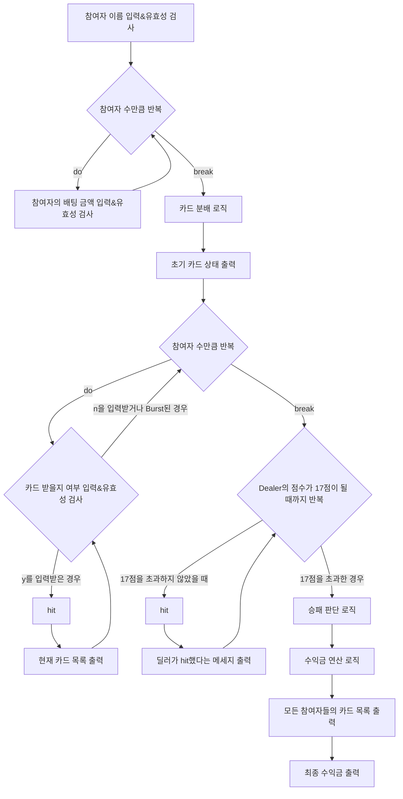

# 우테코 5기 1레벨 4~5주차 - 블랙잭 미션&제네릭 구현하기 미니 미션


> 우아한테크코스 5기 1레벨 4~5주차 미션, 블랙잭 미션과 제네릭 구현하기 미니 미션을 구현한 저장소입니다.


# 목차
- [시작하기](#시작하기)
- [도메인 모델 네이밍 사전](#도메인-모델-네이밍-사전)
- [프로그램 흐름도](#프로그램-흐름도)
- [기능 목록](#기능-목록)
  - [입력](#입력)
  - [비즈니스 로직](#비즈니스-로직)
  - [출력](#출력)


## 시작하기
해당 레포지토리를 Clone하고 IDE에서 src/main/java에 위치한 Application.java 파일을 실행시켜 프로그램을 동작시킬 수 있습니다.
```
git clone -b as https://github.com/amaran-th/java-blackjack.git
```
## 도메인 모델 네이밍 사전
| 한글명   | 영문명        | 설명                  |
|---------|--------------|---------------------|
| 이름      | Name        | 참가자 이름을 지칭
| 참가자     | Participant | 블랙잭 게임에 참가하는 사람을 지칭 |
| 딜러      | Dealer      | 딜러 지칭              |
| 플레이어   | Player       | 플레이어 지칭             |
| 플레이어들 | Players     | 플레이어들을 지칭              |
| 카드      | Card        | 카드 지칭         |
| 카드 덱    | CardDeck    | 게임 참여자가 소유하고 있는 카드들을 지칭       |
| 카드 풀    | CardPool    | 게임 참여자가 소유하고 있지 않은 모든 카드들을 지칭       |
| 심판 |  Referee       | 블랙잭 게임의 승패 결과와 베팅 수익 결과를 지칭       |
| 베팅금 |    Money     | (플레이어가) 베팅한 금액       |
| 점수 |    Score     | 카드(들)의 점수       |

## 프로그램 흐름도


## 기능 목록
### 입력
- 참여자의 이름을 입력받는다.
- 카드를 받을지 입력을 받는다.
    - (유효성 검사) y 또는 n이 아닐 때 예외처리
    - 만약 플레이어가 BlackJack이 된 경우 건너뛴다
- 플레이어별로 배팅 금액을 입력받는다.
    - (유효성 검사) 숫자가 아닐 때 예외처리
    - (유효성 검사) 양의 정수가 아닐 떄 예외처리

### 비즈니스 로직
- 이름
    - (유효성 검사) 공백이거나 Null이면 안 된다.
- 참가자
    - 모든 참가자는 전체 카드뭉치에서 하나의 랜덤한 카드를 뽑는다.(hit)
    - 인스턴스 변수로 Name을 갖는다.
- 플레이어들(Players)
    - 문자열을 ','를 기준으로 분리한다.
    - 플레이어 객체를 생성하고 저장한다.
    - (유효성 검사)중복된 이름을 가질 수 없다.
    - (유효성 검사)"a, ,b" 경우에도 에러처리하게 패턴추가
- 딜러
    - 딜러가 한 번 더 카드를 뽑아야하는지 여부를 반환한다.
- 카드
    - 인스턴스 변수로 패턴과 심볼을 갖는다.
    - 심볼 값이 "J", "Q", "K"인 카드의 값은 10이다.
    - 심볼 값이 "A"인 카드의 값은 기본적으로 11이다.
    - 그 외의 심볼은 심볼과 같은 숫자 값을 갖는다.
- 카드 덱
    - 카드를 한 장씩 추가할 수 있어야 한다.
        - 단, null은 안 된다.
    - 카드의 개수를 반환해야 한다.
    - 카드의 점수의 합을 반환해야 한다.
    - 현재 카드 덱이 블랙잭 조건을 만족하는지 여부를 반환한다.
- 카드 풀
    - 초기에 모든 카드(52장)를 가지고 있어야 한다.
    - 카드를 한 장씩 제거할 수 있어야 한다.
    - 카드는 카드 풀에 존재하는 카드 중 하나를 랜덤으로 골라 추출해야 한다.
- 심판
    - 전체 플레이어들(Players)의 승패 여부를 판단한다.
    - 전체 플레이어들의 최종 수익 금액을 연산한다.
    - 딜러의 총 수익 금액을 연산한다.
    - 입력받은 Dealer와 Players 객체, 베팅 금액 List에 대해 승패 여부/수익 금액을 반환하는 메서드를 구현한다.
- 배팅금액(값객체)
    - 플레이어가 베팅하는 금액(int)을 값으로 가진다.
    - (유효성 검사)입력 값이 0이거나 음수인 경우 예외처리한다.
    - 승패 여부와 배팅 금액을 입력받고 수익금액을 반환하는 메서드 구현
- 점수(값객체)
    - 현재 점수에서 에이스 카드의 점수를 합산하여 반환한다.
    - Burst가 되지 않으면서 가능한 가장 큰 점수를 계산해야 한다.
    - 점수가 21점을 초과하면 Burst이다.

### 출력
- 초기 카드 목록를 출력한다.
    - 참여자별로 카드 목록을 출력한다.
- 특정 참여자의 '현재' 카드 목록를 출력한다.
- 딜러가 카드를 뽑았다는 기록을 출력한다.
- 결과 카드 목록을 출력한다.
- 승패 결과를 출력한다.
- 참여자별로 카드 목록을 출력한다.
- 참여자 이름과 함께 수익금을 출력한다.
